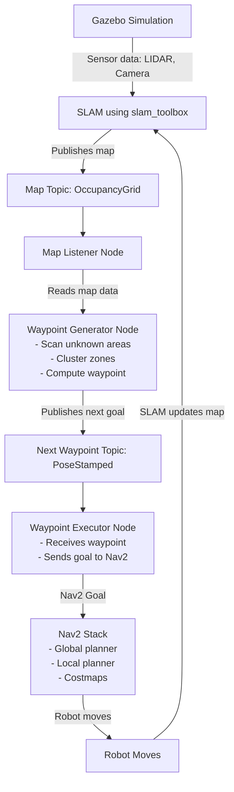

# Auto-Waypoint-Navigation
Autonomous indoor exploration system for ROS2 using auto-generated waypoints. Automatically detects unexplored areas from the SLAM map, generates navigation goals, and drives the robot until the entire map is covered.

## ✅ Prerequisites & What You Should Have Installed

Before starting, make sure you have:

1. ROS 2 (e.g. Humble) installed.
2. Gazebo + gazebo_ros_pkgs installed (so simulation works)
3. SLAM package (e.g. slam_toolbox) installed.
4. Nav2 installed. 
5. The Auto-Waypoint-Navigation repo cloned into a ROS2 workspace.

For a guide on above installations refer to [Setup/setup.md in ROS2-Autonomous-TurtleBot](https://github.com/shimmer0909/ROS2-Autonomous-TurtleBot) repository.

## 🔧 Step-by-Step to Run the Full System

Assuming you have a fresh workspace (or you make one), and are cloning the Auto-Waypoint-Navigation repo inside it. Example steps:

```bash
# 1. Create workspace (if you don’t have one)
mkdir -p ~/ros2_ws/src
cd ~/ros2_ws

# 2. Clone the Auto-Waypoint-Navigation repo
cd src
git clone https://github.com/shimmer0909/Auto-Waypoint-Navigation.git

# 3. Build workspace
cd ~/ros2_ws
colcon build --symlink-install
source install/setup.bash
```
At this point the Auto-Waypoint-Navigation package should be compiled and available.

To make source permanent, add it to your .bashrc: 
```bash
echo "source ~/turtlebot3_ws/install/setup.bash" >> ~/.bashrc
```

Also add export TURTLEBOT3_MODEL=waffle in your ~/.bashrc file and source it using gedit.

### 🚀 Launching Simulation + SLAM + Nav2 + Auto-Explore + RViz

You need to run multiple components together (Gazebo, SLAM, Nav2, RViz, auto-waypoint nodes). Here is a recommended multi-terminal launch order:

```bash
# Terminal 1 - Launch Gazebo with TurtleBot3 House or World
ros2 launch turtlebot3_gazebo turtlebot3_house.launch.py

# Terminal 2 - Run SLAM mapping (e.g., Cartographer)
ros2 launch turtlebot3_cartographer cartographer.launch.py use_sim_time:=true
#or
ros2 launch slam_toolbox online_async_launch.py use_sim_time:=true

# Terminal 3 - Run Nav2
ros2 launch nav2_bringup navigation_launch.py use_sim_time:=true

# Terminal 4 - Run Rviz for map observation
rviz2 -d /opt/ros/humble/share/nav2_bringup/rviz/nav2_default_view.rviz

# Terminal 5 - Launch Auto-Waypoint-Navigation
ros2 launch auto_explore auto_explore.launch.py
```

## 🛠 Potential Pitfalls & What to Check if It Doesn’t Work

### 1. Waypoints are being generated, but Nav2 is NOT executing them.

Log in Nav2 Terminal that confirm's it
```vbnet
Message Filter dropping message: frame 'base_scan' at time X 
for reason 'the timestamp on the message is earlier than all the data in the transform cache'
```

This means:

1. Your LIDAR topic /scan has timestamps not synchronized with TF
2. Or /tf has no valid transform from base_scan → base_link
3. Or simulation time (use_sim_time) is inconsistent
4. So Nav2 discards sensor data → costmap stays empty → robot cannot plan → waypoints not executed

Fix:

1. Check if /scan is publishing
```bash
ros2 topic echo /scan
```
2. Nav2 and slam_toolbox must use use_sim_time:=true

3. Check TF tree
```bash
ros2 run tf2_tools view_frames.py
```
**If output is 'No executable found'.**
The command failed because tf2_tools is not installed in ROS 2 Humble by default.

Install the package and then run it:
```bash
sudo apt install ros-humble-tf2-tools
ros2 run tf2_tools view_frames
```

## 📌 Architecture Overview
```bash
SLAM → /map → Waypoint Generator → /next_waypoint → Nav2 → Robot moves → 
Map updates → Repeat
```

## 🧭 HIGH-LEVEL FLOW OF THE WHOLE EXPLORATION SYSTEM



## 🧠 WHAT EACH COMPONENT DOES (HUMAN LANGUAGE EXPLANATION)

### 1️⃣ Gazebo

1. Simulates robot + sensors.
2. Publishes LIDAR data → goes into SLAM.

### 2️⃣ SLAM (Map Building)

SLAM converts raw sensor data into Occupancy Grid:
```bash
/map → OccupancyGrid (free, occupied, unknown)
```
SLAM updates the map continuously as the robot moves.

### 3️⃣ Map Listener Node

**Purpose:**
Just stores the latest map in a variable.

**Why needed?**
1. The waypoint generator must read the map.
2. But best practice is not to subscribe inside multiple nodes → so we separate it.

**Publisher/subscriber:**
1. Subscribes → /map
2. No publishers.

### 4️⃣ Waypoint Generator

This is the intelligent part.

It reads the map and decides where the robot should go next.

**Steps it performs:**
 
1. Convert occupancy grid into a usable array
2. Find all unexplored regions (-1 in map)
3. Cluster them into big logical zones
4. Pick 1 zone to explore
5. Compute the (x, y) world coordinate
6. Publish that as a waypoint

**Publisher/subscriber:**
1. Subscribes → /map
2. Publishes → /next_waypoint (PoseStamped)

### 5️⃣ Waypoint Executor

**Purpose:**
Take a waypoint and tell Nav2 to go there.

**Publisher/subscriber/action:**
1. Subscribes → /next_waypoint
2. Action Client → navigate_to_pose (Nav2)

**It waits until:**
1. Nav2 reaches the waypoint
2. Then waits for the next waypoint from the generator

### 6️⃣ Nav2

**This performs actual navigation:**
1. Global planner → long path
2. Local planner → avoid obstacles
3. Controller → movement
4. Costmaps → safe distances
5. Recovery behaviours

**It uses:**
1. /tf
2. /odom
3. /map
4. Laser scans

### 7️⃣ Robot Moves → SLAM updates → cycle repeats

**Every time the robot moves:**
1. SLAM updates the map
2. New unexplored areas appear
3. New waypoints get generated
4. Nav2 moves again.
Until the map is fully explored.

## 💡 HOW WE DECIDE WHICH MESSAGE TYPES TO USE
**A. What does the node need to read?**
🔹 Map listener needs a map → /map → OccupancyGrid
So it subscribes using:
```bash
ros2 topic info /map
ros2 interface show nav_msgs/msg/OccupancyGrid
```
```python
create_subscription(OccupancyGrid, '/map', ...)
```

**B. What does the next node need?**
1. Waypoint generator needs the map → so it subscribes to the same topic.
2. But it also outputs a waypoint → it should publish a PoseStamped because Nav2's NavigateToPose action expects: geometry_msgs/PoseStamped

**C. How do we send the waypoint to Nav2?**
Nav2 uses actions, not topics.
```bash
nav2_msgs/action/NavigateToPose
```
So the executor must be an Action Client:
```python
nav_client = ActionClient(self, NavigateToPose, 'navigate_to_pose')
```

## Notes
1. Install sklearn if not already
```bash
pip3 install scikit-learn
or
sudo apt install python3-sklearn
```

2. scikit-learn + SciPy DO NOT work with NumPy 2.x 
Use Pure NumPy coarse grid clustering instead of scikit-learn, sciPy and KMean
